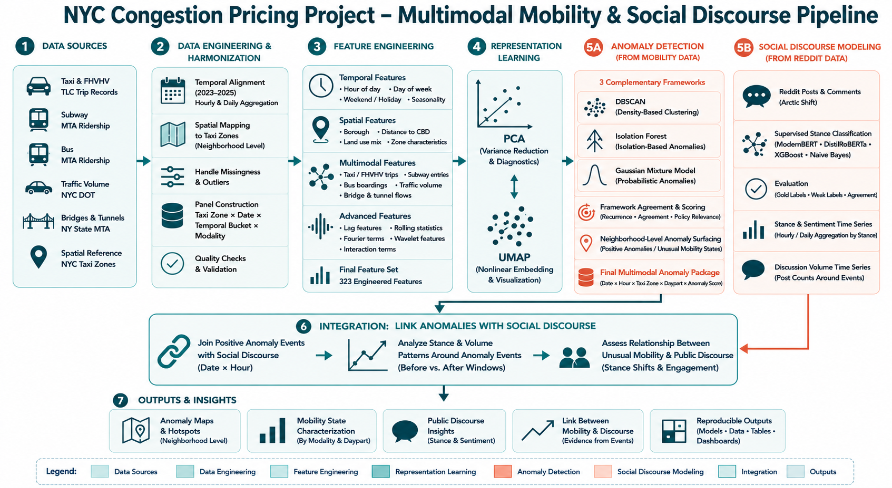
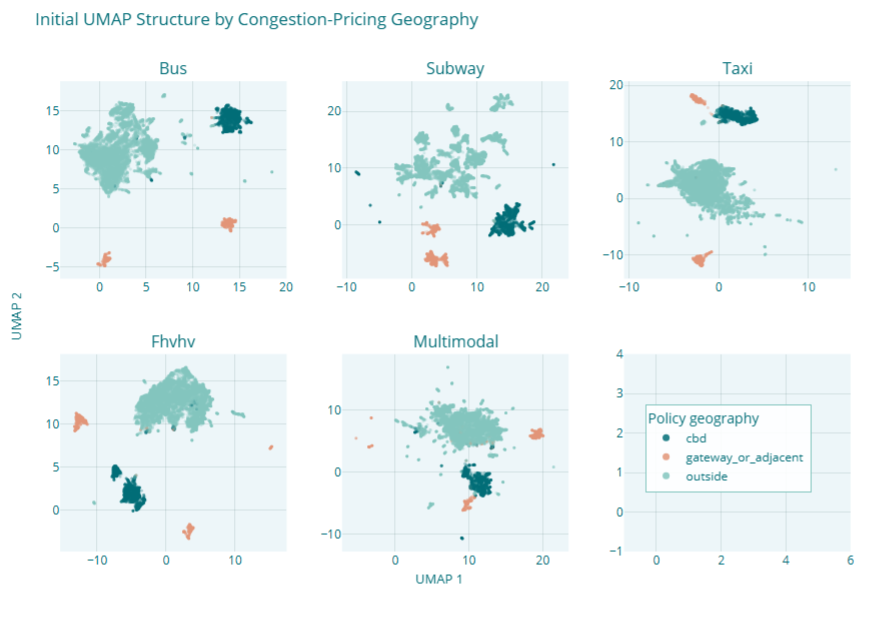
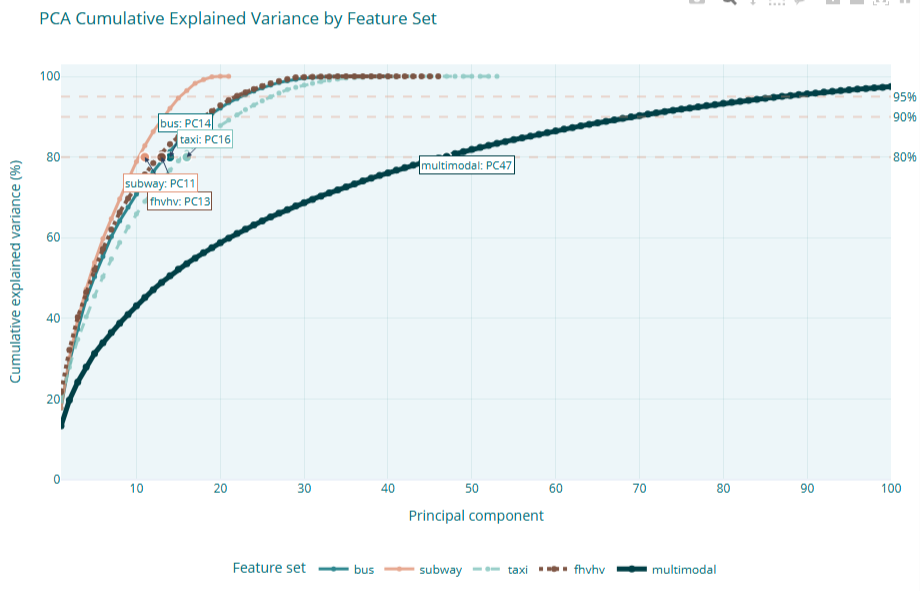
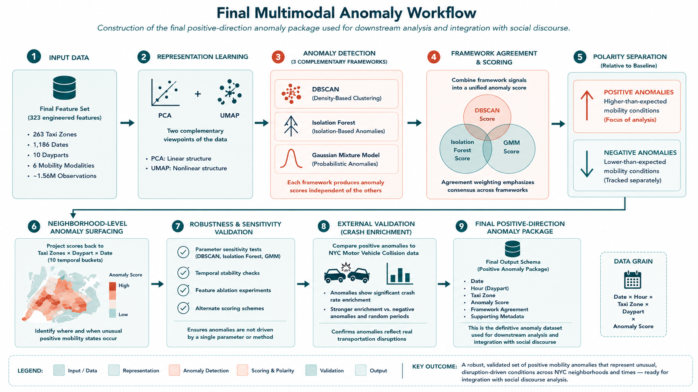
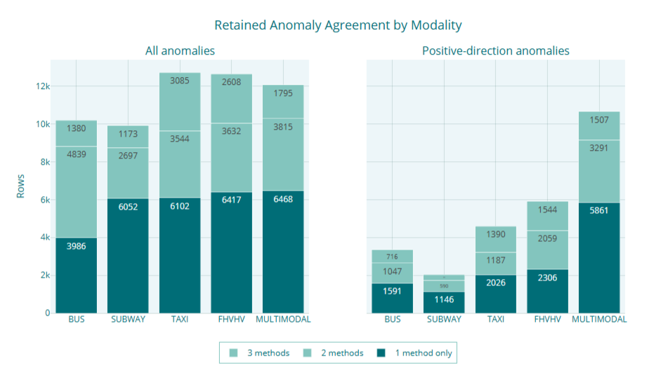
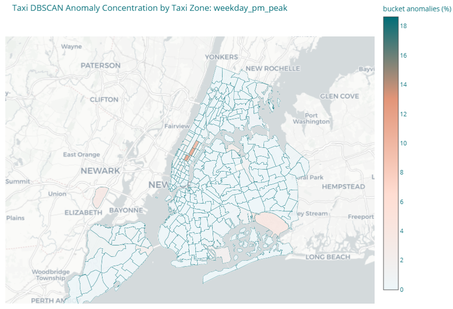

# SIADS 696 NYC Congestion Pricing Project

*A multimodal machine learning analysis of New York City's Central Business District Tolling Program*

**University of Michigan — Master of Applied Data Science**  
**SIADS 696 Milestone II Final Project**

---



## Overview

This project investigates how New York City's Central Business District Tolling Program (CBDTP) changed mobility patterns across the city by combining multimodal transportation data with public social discourse from Reddit.

Rather than relying on a single transportation system, we construct a unified mobility panel spanning taxi, FHVHV, subway, bus, roadway traffic, and bridge-and-tunnel activity. We engineer hundreds of temporal, spatial, and multimodal features, learn lower-dimensional representations of citywide mobility, detect unusual mobility states using multiple anomaly-detection frameworks, and finally examine how those anomalies relate to changes in Reddit discussion volume, stance, and sentiment.

---

## Team

- Jaime Singson
- Freya Van de Motter
- Anita Nti

---

# Project Highlights

| | |
|---|---:|
| Study Period | January 2023 – March 2026 |
| Transportation Modalities | 6 |
| NYC Taxi Zones | 263 |
| Temporal Buckets | 10 |
| Engineered Features | 323 |
| Final Mobility Panel | ~1.56 million observations |
| Representation Learning | PCA, UMAP |
| Anomaly Detection | DBSCAN, Isolation Forest, Gaussian Mixture Models |
| Reddit Models | ModernBERT, DistilRoBERTa, XGBoost, Naive Bayes |

---

# Repository Structure

```text
Reddit/
    2.1   - Data Collection
    2.2.x - Relevance Filtering
    2.3.x - Labeling
    2.4.x - Classifiers
    2.5.x - Analysis
    2.6.x - Evaluation
    2.7   - Inter-Annotator Agreement
    data/           # samples only - see 2.1 for Data Collection information
    models/         # placeholder - trained models too large to upload
    requirements/   # requirements.txt files for the individual notebooks
    README.md       # README detailing the Reddit analysis in greater detail.


notebooks/
    1.x   Data ingestion and harmonization
    2.x   Reddit NLP pipeline
    3.x   Representation learning, anomaly detection, and integration

source_data/
    Raw transportation datasets

pipeline_data/
    Intermediate and engineered datasets generated throughout the pipeline

images/
    Figures used throughout this repository

PROJECT_SPEC.md
PROJECT_STATE.md
NOTEBOOK_INDEX.md
DECISIONS.md
README.md
requirements.txt
```

---

# End-to-End Analytical Pipeline

The project consists of two complementary analytical tracks.

- **Mobility analytics** transforms heterogeneous transportation datasets into a unified Taxi Zone × Date × Temporal Bucket mobility panel before identifying unusual mobility states using multiple complementary anomaly-detection methods.

- **Social discourse analytics** classifies Reddit discussions surrounding congestion pricing using supervised machine learning before relating public discussion patterns to detected transportation anomalies.

The two analytical streams are integrated only after the final mobility anomaly package has been constructed.

---

## Representation Learning



Principal Component Analysis (PCA) and Uniform Manifold Approximation and Projection (UMAP) were used to explore both linear and nonlinear structure within each transportation modality. These representations provided diagnostic insight into geographic organization, congestion-pricing boundaries, and multimodal mobility structure prior to anomaly detection.

---

## Dimensionality Reduction



PCA was evaluated independently across each transportation modality to understand intrinsic dimensionality and feature redundancy before constructing downstream anomaly-detection models.

---

## Final Multimodal Anomaly Workflow



Positive-direction mobility anomalies were generated using three complementary frameworks:

- DBSCAN
- Isolation Forest
- Gaussian Mixture Models

Rather than relying on any individual algorithm, framework agreement was incorporated into a unified anomaly score. Final anomaly surfaces were evaluated for robustness, spatial coherence, crash enrichment, and downstream usefulness before being integrated with Reddit discourse.

---

## Framework Agreement



Each anomaly-detection framework contributes unique information about unusual mobility conditions. Rather than selecting a single "best" method, this project evaluates agreement across frameworks to identify more robust mobility anomalies.

---

## Example Mobility Anomaly Surface



Neighborhood-level anomaly maps identify where and when mobility conditions deviate substantially from historical expectations. These anomaly surfaces become the primary inputs to downstream policy analysis and social-discourse integration.

---

# Data Sources

Transportation datasets include:

- NYC Taxi & Limousine Commission (Yellow Taxi, Green Taxi, FHVHV)
- NYC DOT Traffic Volume Counts
- MTA Subway Ridership
- MTA Bus Route Speeds
- MTA Bridges & Tunnels Hourly Crossings
- NYC Taxi Zone spatial reference layers

Public discourse was collected from Reddit using the Arctic Shift API and their online Download Tool.

---

# Machine Learning Methods

## Supervised Learning

The Reddit pipeline evaluates multiple supervised classification models for stance prediction, including:

- ModernBERT
- DistilRoBERTa
- XGBoost
- Naive Bayes (ComplementNB)

Models were evaluated using weak labels (from Sonnet 4.6), human "gold" labels, multiple classification metrics, and ablation and sensitivity analysis.

## Unsupervised Learning

The mobility pipeline applies multiple complementary unsupervised techniques, including:

- Principal Component Analysis (PCA)
- Uniform Manifold Approximation and Projection (UMAP)
- DBSCAN
- Isolation Forest
- Gaussian Mixture Models

Framework agreement, recurrence analysis, crash enrichment, and robustness experiments were used to evaluate anomaly quality.

---

# Key Findings

- Congestion-pricing geography emerged as one of the strongest organizing principles across multiple transportation modalities.
- Linear and nonlinear representations revealed consistent geographic structure surrounding the Central Business District and adjacent gateway neighborhoods.
- Multiple anomaly-detection frameworks captured complementary aspects of unusual mobility behavior, with meaningful agreement across methods.
- Positive-direction mobility anomalies exhibited measurable enrichment with reported motor vehicle collisions, supporting their interpretation as genuine transportation disruptions.
- Integrating anomaly events with Reddit activity showed that unusual mobility conditions were associated more strongly with increased discussion volume than with large shifts in public stance.

---

# Reproducibility

The notebooks are organized sequentially and are intended to be executed in numerical order.

Most notebooks consume intermediate datasets generated by earlier stages of the pipeline. Reproducing the complete workflow therefore requires the raw source datasets contained within `source_data/` and sufficient disk space for intermediate outputs generated under `pipeline_data/`.

---

# Limitations

- Reddit users are not representative of the general NYC population.
- Anomalies represent statistically unusual mobility conditions rather than definitive evidence of policy causality.
- Several transportation datasets differ substantially in geographic coverage and temporal resolution, requiring harmonization and missing-data handling prior to integration.

---

### Oversized Source Files

Due to GitHub's file size limits, the complete versions of three raw source datasets are not included in this repository:

* `source_data/MTA_Bridges_and_Tunnels_Hourly_Crossings__Beginning_2019_20260530.csv`
* `source_data/bus/mta_bus_route_segment_speeds_2023_2024.csv`
* `source_data/bus/mta_bus_route_segment_speeds_2025_plus.csv`

To preserve the repository structure and document the original data format, representative sample files (`*_SAMPLE.csv`) are included in the corresponding directories. These samples retain the original schema and provide representative records for inspection and pipeline validation. Users wishing to reproduce the complete analysis should download the full datasets from their original public data sources and place them in the same directory locations using the original filenames.

---

# Course Context

This repository contains the final project submitted for **SIADS 696 (Milestone II)** within the **University of Michigan Master of Applied Data Science (MADS)** program.
